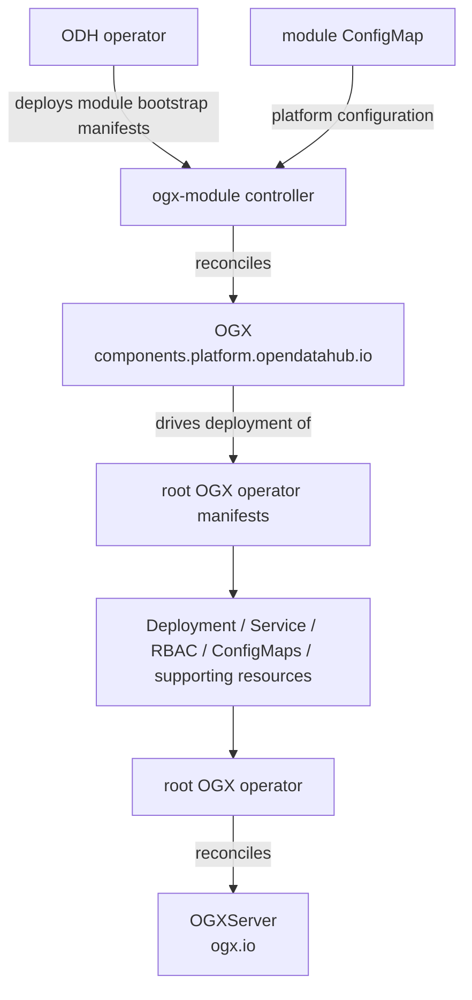

# OGX Module

This directory introduces a new, separate ODH module-operator subtree for OGX.

The main change is architectural: instead of extending the repository root
operator bootstrap path, we are adding a dedicated `ogx-module/` module with its
own Go module, manager entrypoint, API package, config tree, and documentation.

## Why this was added

The repository root still contains the standalone OGX operator that reconciles
`OGXServer` resources under the `ogx.io` API group. That path is kept intact.

The new `ogx-module/` subtree is being introduced so ODH-facing module support
can evolve independently:

- its own binary and startup flow
- its own ODH-facing API surface
- its own module manifests
- its own controller and packaging structure

This avoids coupling ODH module work to the standalone operator's existing
`main.go`, config layout, and release path.

## Important separation from the root operator

The root operator and the new module subtree serve different purposes:

- Root operator:
  - standalone OGX operator
  - reconciles `OGXServer`
  - uses the existing repository-wide bootstrap and packaging flow
- `ogx-module/`:
  - ODH module-operator path
  - will reconcile the ODH-facing `OGX` custom resource
  - will carry its own module manifests and controller wiring

In other words, this directory does not replace the root operator. It creates a
parallel module-oriented implementation path for ODH integration.

## Feature overview

The OGX module feature is intended to provide an ODH-facing module operator
path with the following characteristics:

- a dedicated `OGX` custom resource under
  `components.platform.opendatahub.io`
- a singleton, platform-oriented control plane for OGX
- module-specific manifests and packaging that can be vendored by ODH
- separate controller wiring and startup flow from the standalone operator
- room for ODH-specific configuration, lifecycle, and status reporting without
  changing the root operator contract

This subtree is the place where the ODH module implementation lives, while the
root of the repository remains the home of the standalone `OGXServer`
operator.

## What this module includes

The `ogx-module/` subtree is intended to contain the ODH-facing OGX module
implementation end to end. That includes:

- the `OGX` module API under `components.platform.opendatahub.io`
- the module controller and its reconciliation flow
- module-specific bootstrap manifests for deployment by ODH
- module configuration consumed from the ODH-provided ConfigMap
- status reporting back through the `OGX` custom resource

It does not replace the standalone `OGXServer` API. Instead, it adds the ODH
module control plane that ODH can deploy, configure, and monitor as part of
the platform.

## Architecture and ownership

The intended ownership model is:



At a high level:

- ODH is responsible for deploying the module operator itself
- the module operator is responsible for reconciling the ODH-facing `OGX` CR
- the module operator manages the deployment of the **root OGX operator
  manifests**
- the deployed root OGX operator remains the controller that reconciles
  `OGXServer`

## How OGX is deployed in ODH

With this structure, ODH no longer needs to wire OGX by extending the root
operator bootstrap directly. Instead, the deployment flow becomes:

1. ODH vendors the module bootstrap manifests produced from `ogx-module/`.
2. ODH deploys the OGX module operator into the target ODH namespace.
3. ODH creates or manages the singleton `OGX` custom resource.
4. The OGX module operator reconciles that `OGX` resource and deploys the
   manifests of the root OGX operator.
5. The deployed root OGX operator manages `OGXServer` resources and the
   associated OGX runtime resources.
6. Status is reported back through the `OGX` CR so ODH can aggregate module
   health.

This gives OGX an ODH-native module path with its own API, controller, and
packaging lifecycle, instead of mixing ODH module behavior into the standalone
root operator entrypoint.

## Build the image

The module operator image is built from the repository root using the module
Dockerfile:

```bash
docker build -f ogx-module/Dockerfile -t quay.io/<user>/odh-ogx-module-operator:dev .
```

During the build:

1. the `ogx-module` manager binary is compiled
2. the module `hack/get_manifests.sh` script stages the root OGX operator
   manifests into `ogx-module/config/manifests/ogx`
3. those staged manifests are baked into the final image under `/manifests`

This means the module operator image contains both:

- the `ogx-module` controller binary
- the root `ogx-k8s-operator` manifests that the controller will render and deploy

## Deploy the `ogx-module` operator

The module operator bootstrap manifests live under `ogx-module/config/`.
The default kustomization deploys:

- the `OGX` CRD
- RBAC for the module controller
- the module controller `Deployment`
- the module controller `ConfigMap`

You can render or apply the default bundle with:

```bash
kustomize build ogx-module/config/default
```

or:

```bash
kustomize build ogx-module/config/default | kubectl apply -f -
```

The default bundle deploys the module operator into the
`opendatahub-ogx-system` namespace.

The module controller `Deployment` also carries the environment variables used
by the module runtime:

- `ODH_MODULE_OPERATOR_CONFIGURATION_PATH`
- `ODH_MODULE_OPERATOR_MANIFESTS_PATH`
- `APPLICATIONS_NAMESPACE`
- `RELATED_IMAGE_ODH_OGX_CORE_IMAGE`
- `RELATED_IMAGE_ODH_OGX_K8S_OPERATOR_IMAGE`

## Create the `OGX` custom resource

Once the module operator is running, create the singleton `OGX` resource:

```yaml
apiVersion: components.platform.opendatahub.io/v1alpha1
kind: OGX
metadata:
  name: default-ogx
spec:
  managementState: Managed
```

Apply it with:

```bash
kubectl apply -f ogx-module.yaml
```

## How the `OGX` CR deploys the root operator

The `OGX` resource is the trigger for the module controller.

When the module controller reconciles `default-ogx`, it:

1. reads the selected platform settings and image overrides
2. renders the staged root `ogx-k8s-operator` manifests from `/manifests/ogx`
3. applies those manifests with server-side apply
4. waits for the root OGX operator `Deployment` and webhook resources to become ready
5. updates the `OGX` status conditions and release metadata

So the module operator does **not** directly create `OGXServer` instances.
Instead:

- `OGX` deploys the root `ogx-k8s-operator`
- the root `ogx-k8s-operator` continues to reconcile `OGXServer`
- module status is reported back through the cluster-scoped `OGX` CR

## Example lifecycle

```text
1. Deploy ogx-module operator
2. Create default-ogx
3. ogx-module renders and deploys root ogx-k8s-operator manifests
4. root ogx-k8s-operator becomes ready
5. root operator manages OGXServer resources
6. OGX status reflects provisioning, readiness, degradation, and releases
```

## Running e2e tests

The module e2e suite lives in `tests/e2e/` and follows the same layout as the standalone operator suite: validation, creation, then deletion.

It expects the module operator to already be running in the cluster. From the repository root:

```bash
make ogx-module-deploy OGX_MODULE_IMG=<module-image> OGX_K8S_OPERATOR_IMG=<root-operator-image>
make test-ogx-module-e2e
```

The suite:

1. Validates the `OGX` CRD and module operator deployment.
2. Creates `default-ogx` and waits for the root `ogx-k8s-operator` deployment and status conditions to become ready.
3. Sets `managementState: Removed`, verifies the root operator is cleaned up, then deletes the `OGX` CR.

On vanilla Kubernetes the tests create a self-signed `ogx-k8s-operator-webhook-cert` secret so the root operator pod can start without OpenShift service-serving-cert injection.

## Directory layout

```text
ogx-module/
  README.md
  go.mod
  cmd/ogx-module/main.go
  config/
  docs/
  pkg/apis/v1alpha1/
  tests/e2e/
  tests/scripts/
```
